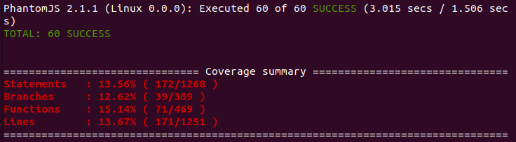
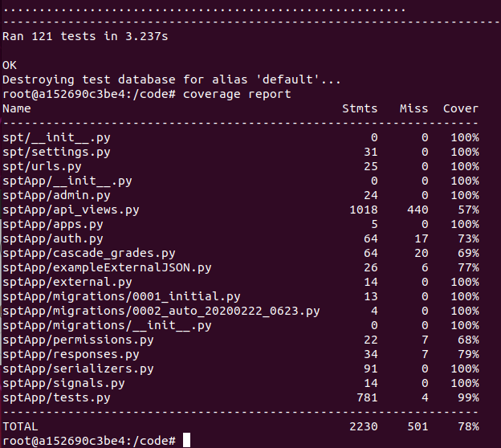

## Coverage Breakdown
- Frontend Coverage: 13 percent of lines ***
- Backend Coverage: 78 percent of lines

## Frontend Coverage
- We retrieved these results by running this command:
```
npm run test-frontend
```
- This command runs all the tests on our frontend, and simply reports which tests pass and fail.
- It notably provides very little additional information, such as which lines remain un-covered. Though we'd hoped to use a more helpful tool, the frontend with which we were provided was difficult to configure with any other sort of testing framework.
- *** Additionally, it appears that our predecessors did not create any significant portion of tests for their frontend either, as our run of their old repo only shows around 20 percent frontend code coverage. We managed to keep up with and even exceed the requisite code coverage on the backend, but could not account for this vast shortcoming on the frontend.
  - In other words, we could not in two weeks rectify a deficit in code coverage which should have been mended last year over the course of two semesters. 
- 

## Backend Coverage
- We retrieved these results by running these commands:
```
coverage run --source='.' manage.py test
coverage report
```
- These commands are based on the instructions provided to us in the assignment. This basically configures coverage.py to work well within Django, though we did have to delete a few extraneous files in order to avoid some compilation errors caused by running the second command.
- 