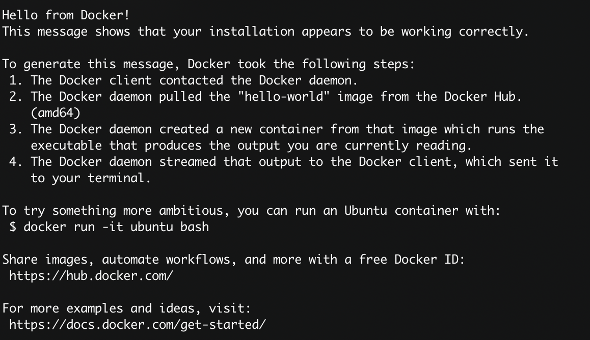

# Installing Docker CE and Docker-Compose

1. Install Docker (for ubuntu)
  ```
  sudo apt update
  sudo apt install docker.io
  ```
2. Test the installation of Docker 
   - Run `sudo docker run hello-world` in the terminal
   - You will see this window on successful install
     - 
3. Install Docker-Compose
   - Download the latest version
     - Run `sudo curl -L "https://github.com/docker/compose/releases/download/1.23.2/docker-compose-$(uname -s)-$(uname -m)" -o /usr/local/bin/docker-compose`
   - Apply permissions
     - Run `sudo chmod +x /usr/local/bin/docker-compose`
   - Create a symbolic link
     - Run `sudo ln -s /usr/local/bin/docker-compose /usr/bin/docker-compose`
   - Test the install
     - Run `docker-compose --version`
     - On success you will see an output similar to 
4. Configure Docker to run on boot
   - Run `sudo systemctl enable docker` in the terminal
5. Configure Docker to run as non-admin
   - Run `sudo usermod -aG docker ${USER}`
   - Logout and log back in