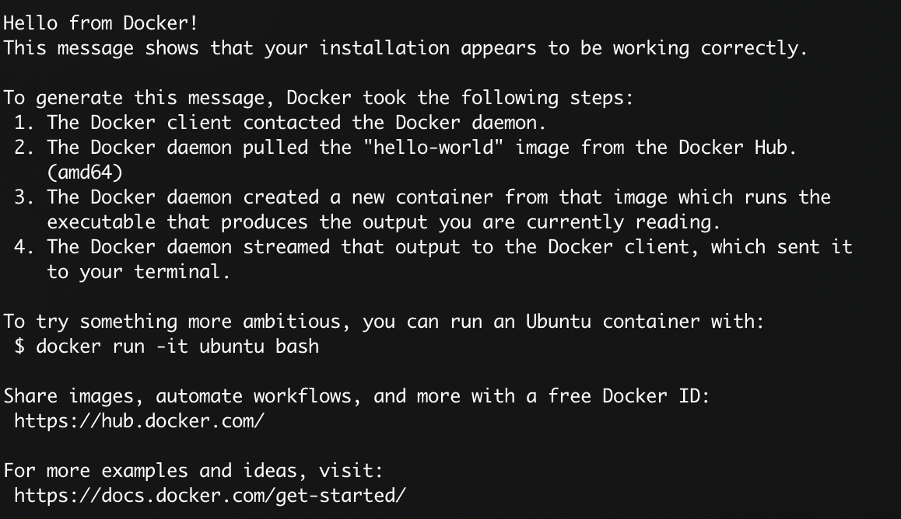
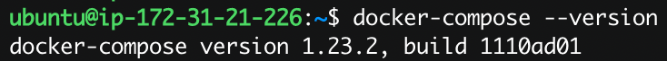
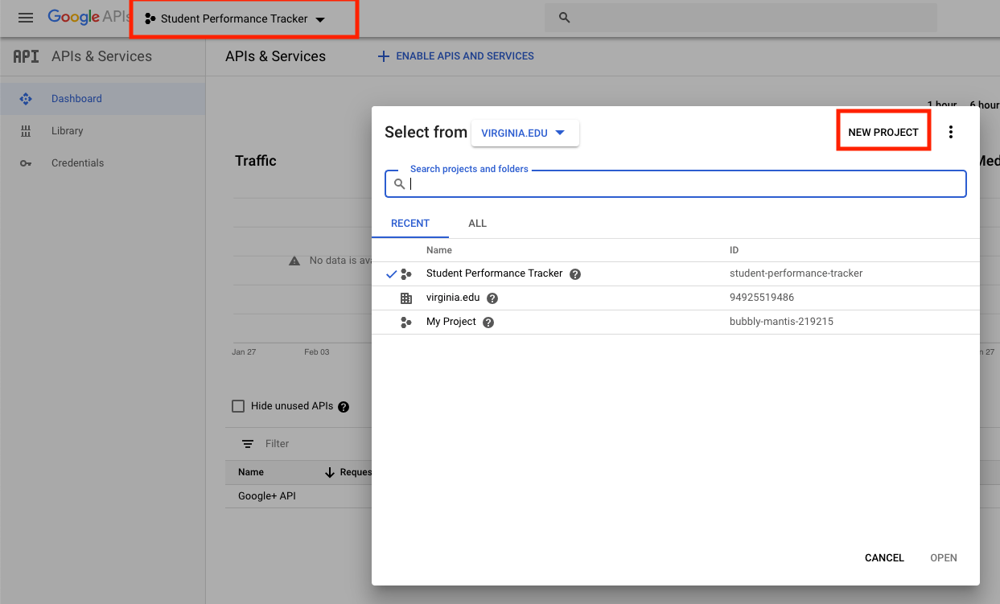
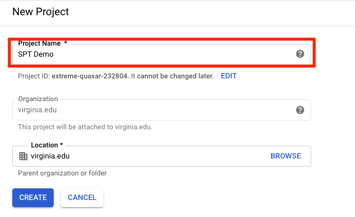
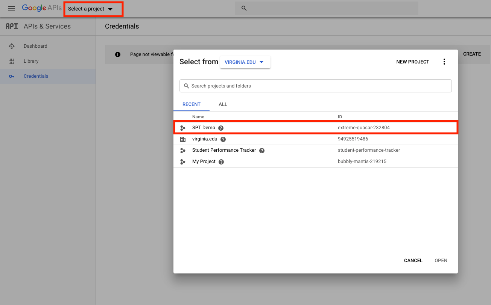
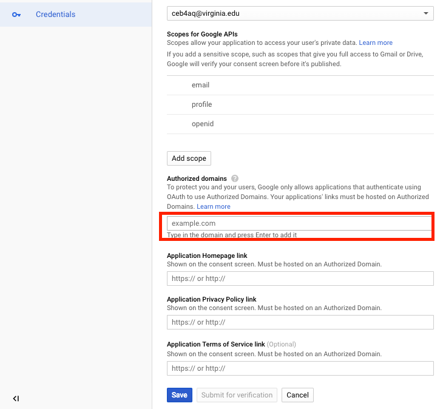
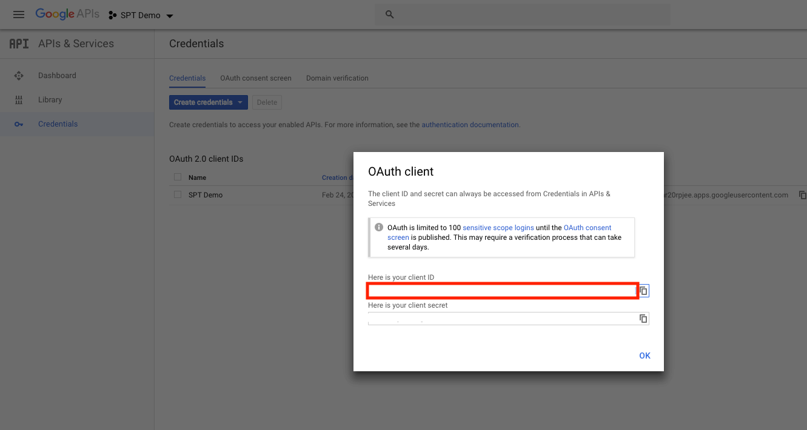
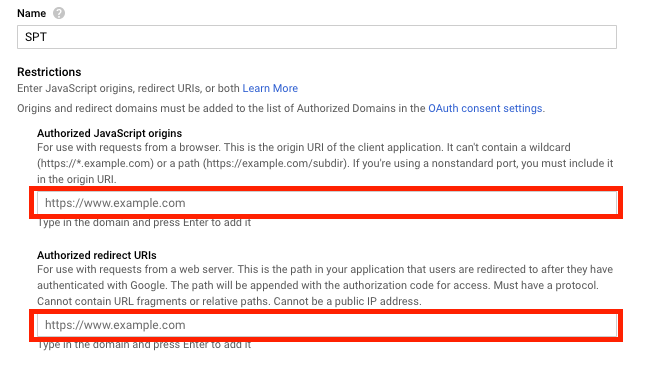

# Installation Instructions

## Table of Contents

1. Assumptions
2. Installing Docker CE and Docker-Compose
3. Pulling the repository
4. Setting up Google OAuth
5. Running docker-compose and viewing project
6. Help / Uninstalling

## Assumptions

- The system you are using will have more than 4GB of ram
  - 8GB is recommended
- The system will be hosted on a Unix based OS (Linux, MacOS)
  - We will be basing the install instructions on Ubuntu Server 18.04 LTS

## Installing Docker CE and Docker-Compose

1. Visit [docker](https://docs.docker.com/install/linux/docker-ce/ubuntu/)
2. Run the _Uninstall old versions_ command
   - `sudo apt-get remove docker docker-engine docker.io containerd runc`
3. Follow the _Install Docker CE_ instructions

   - Update the packages
     - `sudo apt-get update`
     - Select `Y` if prompted
   - Install packages to allow apt to use a repository over HTTPS:
     - ```
       sudo apt-get install \
       apt-transport-https \
       ca-certificates \
       curl \
       gnupg-agent \
       software-properties-common
       ```
       - Select `Y` if prompted
   - Add Docker’s official GPG key:
     - `curl -fsSL https://download.docker.com/linux/ubuntu/gpg | sudo apt-key add -`
     - On successful add, you will recieve an `OK` in the terminal
   - Add the docker repository
     - `sudo add-apt-repository \ "deb [arch=amd64] https://download.docker.com/linux/ubuntu \ $(lsb_release -cs) \ stable"`
     - On successful add, you will recieve `Reading package lists... Done` in the terminal with no warnings or errors
   - Update the packages again with docker in the repository this time
     - Run `sudo apt-get update`
   - Install the latest version of _Docker CE_
     - Run `sudo apt-get install docker-ce docker-ce-cli containerd.io`
     - Select `Y` when prompted
     - There will be no errors or warnings when finished

4. Test installation of Docker CE
   - Run `sudo docker run hello-world` in the terminal
   - You will see this window on successful install
     - 
5. Install Docker-Compose

   - Download the latest version
     - Run `sudo curl -L "https://github.com/docker/compose/releases/download/1.23.2/docker-compose-$(uname -s)-$(uname -m)" -o /usr/local/bin/docker-compose`
   - Apply permissions
     - Run `sudo chmod +x /usr/local/bin/docker-compose`
   - Create a symbolic link
     - Run `sudo ln -s /usr/local/bin/docker-compose /usr/bin/docker-compose`
   - Test the install
     - Run `docker-compose --version`
     - On success you will see an output similar to 

6. Configure Docker to run on boot
   - Run `sudo systemctl enable docker` in the terminal
7. Configure Docker to run as non-admin
   - Run `sudo usermod -aG docker ${USER}`

### After installation logout and log back in

## Pulling the repository

1.  You can install our project by downloading it from [GitHub](https://github.com/UVA-Capstone-Practicum-1819/Student-Performance-Tracker-1). We recommend you to fork our repo first, then clone the forked repo to the instance where you will host the website. We assume that you clone the entire repo to the home directory of the instance.

## Setting up Google OAuth

**We are assuming you are using an AWS instance in this part**

This is how the login system works and verifies who a user is

1. Navigate to the [Google API Console](https://console.developers.google.com/)
   - Login using your gmail
     - Create a gmail if you dont have one
2. Create a new project by clicking on the box next to _Google APIs_ then selecting _new project_
   - 
3. Name your new project and click create
   - 
4. Select the new project
   - 
5. Select the _Credentials_ tab on the left menu

- Select the _OAuth Consent Screen_ tab
  - Give the application a name
    - In the example we used _SPT Demo_
    - Add your domain name to the _Authorized Domains_ section
      - Hit enter to add it
      - 
    - Select Save
- Select the _Credentials_ tab
  - Select lick on _Create Credentials_
    - Select _OAuth client ID_
    - Select _Web Application_
      - Name it _SPT_ or another name if desired
    - Click _Save_
- You will be given a pop-up dialog, copy the _Client ID_
  - 
  - Open the project in an IDE
    - navigate to [Auth.js](../src/frontend/src/vuex/modules/Auth.js)
      - `src/frontend/src/vuex/modules/Auth.js`
      - Edit Line `20` to be your client ID
- Select the newly created credentials
  - Add your domain to the _Authorized JavaScript Origins_ and the _Redirect URLs_
    - 
  - Click _Save_

## Project host set-up

1. Add your domain to the allowed hosts
   - Navigate to [Settings.py](../src/backend/spt/settings.py)
     - `src/backend/spt/settings.py`
   - Edit line `35` to include your domain name
     - `ALLOWED_HOSTS = ['<your-domain-here>']`

## Running docker-compose

1.  Go into the _Student-Performance-Tracker-1_ folder that you cloned / downloaded
    - Run `cd Student-Performance-Tracker-1/`
2.  Go into the _src_ folder
    - Run `cd src/`
3.  To run the project, we will utilize docker and docker-compose
    - Stop all older docker images if already running
      - Run `docker-compose down`
    - Start the servers
      - Run `docker-compose -f docker-compose.prod.yml up`
4.  You can navigate to `your-domain` and the project will be running on port `80`
    - If you need to edit the port
      - Navigate to [docker-compose.prod.yml](../src/docker-compose.prod.yml)
        - Edit line `35` where `"<your-port-here>:5000"` is the port you want to run on

## Uninstalling Docker CE and Docker-Compose

If you need to uninstall either Docker CE or Docker-Compose in the future

1. Uninstall Docker CE
   - Uninstall the package
     - Run `sudo apt-get purge docker-ce`
   - Delete all Docker Images and Data
     - Run `sudo rm -rf /var/lib/docker`
   - You must delete any edited configuration files manually.
2. Uninstall Docker-Compose
   - Run `sudo rm /usr/local/bin/docker-compose`
