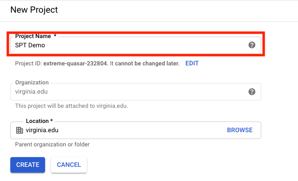

# Setting up Google OAuth

To use Google OAuth, you must register a top level domain with the application. Google will then provide a CLIENT_ID that the application uses when sending and verifying requests. The second capstone team registered the domain `spt-acas.com` for development use. To use this domain, we added the domain to our /etc/hosts file so that it redirects to localhost (instructions in development install instructions).

For local development, OAuth setup is not required because you can load the debug users into the database and simply use those accounts. But if you wish to test OAuth locally, continue with these instructions. If the `spt-acas.com` registration has not expired, then no further steps are required for setting up OAuth for development other than adding the domain to /etc/hosts. If the registration has expired, then you must follow these steps and update the CLIENT_ID in the codebase (intructions below). If you try to log in to the application from spt-acas.com and there is no redirection to Google OAuth, the registration most likely expired.

For a production deployment, you must register the domain that you plan to deploy your application on. Then you must must update the deployment variables in the file src/config/deployment_vars. No other modifications of the codebase are necessary as the production build will automatically incorporate the CLIENT_ID.

1. Navigate to the [Google API Console](https://console.developers.google.com/)
   - Login using your gmail
2. Create a new project by clicking on the box next to _Google APIs_ then selecting _new project_
   - 
3. Name your new project and click create
   - 
4. Select the new project
   - 
6. Select the _OAuth Consent Screen_ tab on the left menu
  - Select _External_.
    - 
  - Give the application a name
  - Add the domain to the authorized domains list.
  - Click save
7. Select the _Credentials_ tab
  - Click on _Create Credentials_
    - Select _OAuth client ID_
    - Select _Web Application_
      - Name it _SPT_ or another name if desired
  - 
  - Add your domain to the _Authorized JavaScript Origins_ and the _Redirect URLs_
    - If using the production deployment, use https, otherwise use http
  - Click _Save_
8.  You will be given a pop-up dialog, copy the _Client ID_
  - 
  - If registering a domain for local development, update the CLIENT_ID in the following two places:
    - navigate to [Auth.js](../src/frontend/src/vuex/modules/Auth.js)
      - `src/frontend/src/vuex/modules/Auth.js`
      - Edit the show line to include your Client ID
      - 
    - navigate to (../src/backend/sptApp/auth.py)
      - Edit the CLIENT_ID to also match your Client ID
  - If registering a domain for a production deployment, update the CLIENT_ID in src/config/deployment_vars